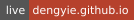
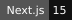
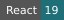
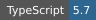
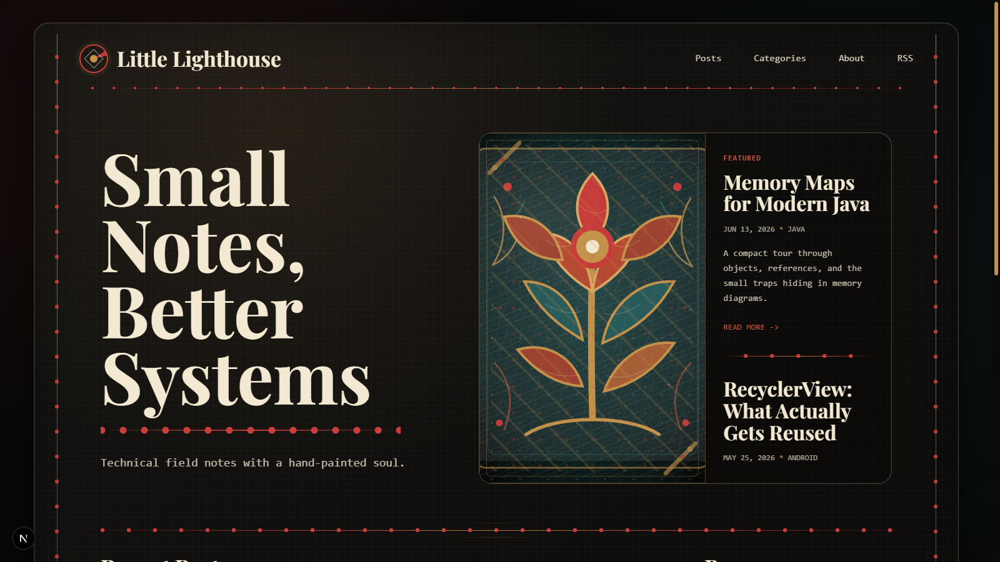
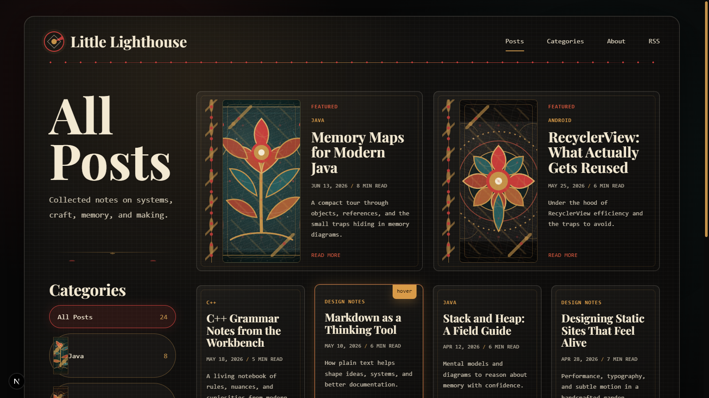
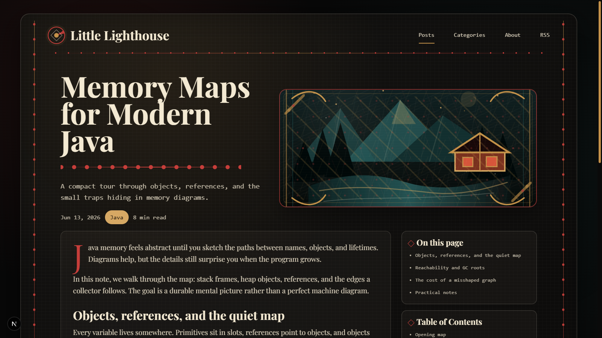

# Little Lighthouse

Chinese: [README.md](README.md)

> A Folk Canvas personal blog built with Next.js static export, focused on editorial layouts, owned illustration assets, and GitHub Pages delivery.

[](https://dengyie.github.io)





Little Lighthouse is a dark-first editorial blog for engineering notes and design writing. The current implementation centers on Folk Canvas styling: framed reading surfaces, folk-inspired ornamentation, local SVG illustrations, and a static export workflow suited for GitHub Pages.

## Preview

| Desktop Home | Mobile Home |
| --- | --- |
|  |  |

| Posts List | Post Detail |
| --- | --- |
|  |  |

## Repository Snapshot

| Item | Notes |
| --- | --- |
| Live site | [dengyie.github.io](https://dengyie.github.io) |
| Primary goal | Rebuild the blog to match the supplied Folk Canvas mockups with high visual fidelity |
| Delivery model | Static export generated by Next.js and deployed to GitHub Pages |
| Content source | Current routes still use Folk Showcase data; the publishing-package chain is in place for future migration |
| Current focus | Editorial presentation, route consistency, local assets, README quality, and the new post workflow |

## What This Project Is

Little Lighthouse is a static personal blog centered on warm editorial presentation for engineering notes. The current direction follows a dark Folk Canvas language: tactile surfaces, ornamental rails, local SVG folk assets, and compact content cards inside a framed reading experience.

The site is designed to ship as a static export for GitHub Pages while keeping the source code maintainable and the visual system reusable.

## Highlights

- Folk Canvas UI with custom local SVG ornaments under `public/ornaments/folk/`
- Static export workflow via Next.js `output: "export"`
- Shared showcase content source for post cards, detail pages, RSS, and sitemap
- Publishing-package foundation with Markdown body files, companion `.meta.json`, validation, defaults, and fallback handling
- Responsive route coverage for homepage, posts index, post detail, and category archive
- Design documentation captured in `design-system/`

## Why This Repository Feels Complete

The repo keeps design notes, route specs, exported QA screenshots, and content sources close to the implementation. That makes the visual intent inspectable instead of leaving it buried in chat history or one-off edits.

## Tech Stack

- Next.js 15
- React 19
- TypeScript
- CSS Modules
- `remark` / `rehype` content rendering pipeline

## Main Routes

| Route | Purpose |
| --- | --- |
| `/` | Homepage with hero, featured notes, categories, and manifesto sections |
| `/posts` | Editorial posts index |
| `/posts/[slug]` | Static post detail page |
| `/categories/[category]` | Category archive page |

## Project Structure

```text
.
|-- design-system/          # Visual specs, implementation plans, route notes
|-- content/                # Markdown bodies and publishing metadata
|-- assets/readme/          # Local README badges and screenshots
|-- output/                 # QA artifacts and screenshots
|-- public/                 # Static assets, ornaments, generated meta files
|-- scripts/                # Build-time helpers
|-- src/
|   |-- app/                # App Router pages
|   |-- components/         # Folk UI and shared components
|   |-- data/               # Shared showcase data source
|   |-- lib/                # Content helpers
|   `-- styles/             # Global tokens
`-- out/                    # Static export output
```

## Local Development

```bash
npm install
npm run dev
```

Build the static export:

```bash
npm run build
```

Before each production build, `scripts/generate-static-meta.mjs` refreshes:

- `public/rss.xml`
- `public/sitemap.xml`
- `public/robots.txt`

## Content And Publishing Model

The current Folk Canvas showcase pages still use a shared JSON content source to keep the shipped routes stable:

- `src/data/folkShowcase.json`
- `src/data/folkShowcase.ts`

That data powers:

- featured and archive cards
- post detail rendering
- category counts
- RSS and sitemap generation

The long-term workflow for adding new posts now uses a publishing-package model:

- `content/posts/<slug>.md` for the article body
- `content/posts/<slug>.meta.json` for title, category, dates, publication state, SEO, and related-post metadata
- `src/lib/publishing/` for resolving, validating, defaults, and fallback warnings
- `src/data/publishing/` for authors, categories, and site-wide defaults

Optional images can live under `public/posts/<slug>/`; when they are missing, category or site defaults are used so the build remains stable.

## Design System

The project stores its design notes and implementation constraints in `design-system/`, including:

- `MASTER.md`
- `IMPLEMENTATION-PLAN.md`
- `ASSET-AND-DATA-SPEC.md`

Useful repository assets:

- `design-system/pages/` for route-specific specs
- `output/qa-screenshots/` for visual QA captures
- `public/ornaments/folk/` for project-owned illustration assets

## Deployment

The live site is published at [dengyie.github.io](https://dengyie.github.io). The project is configured for static hosting, and the build output lands in `out/`.
