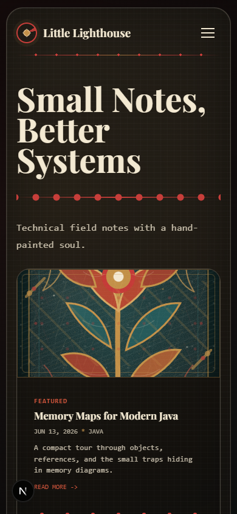

# Little Lighthouse

> A handcrafted Folk Canvas personal blog built with Next.js static export, editorial layouts, and project-owned illustration assets.

[](https://dengyie.github.io)


Little Lighthouse is a dark-first editorial blog experience for engineering notes and design writing. The project mixes a framed reading layout, local folk illustration assets, and a static-export deployment model aimed at GitHub Pages.

## Preview

| Desktop | Mobile |
| --- | --- |
|  |  |

| Posts | Post Detail |
| --- | --- |
|  |  |

## Repository Snapshot

| Area | Notes |
| --- | --- |
| Live site | [dengyie.github.io](https://dengyie.github.io) |
| Primary goal | Rebuild the blog to match the supplied Folk Canvas mockups with high visual fidelity |
| Delivery model | Static export generated by Next.js and deployed to GitHub Pages |
| Content source | Shared Folk Showcase JSON powering cards, detail pages, RSS, and sitemap |
| Current focus | Editorial presentation, route consistency, and asset-backed UI fidelity |

## What This Project Is

Little Lighthouse is a static personal blog focused on warm editorial presentation for engineering notes. The current implementation follows a dark-first Folk Canvas direction: tactile surfaces, ornamental rails, local SVG folk assets, and compact content cards inside a framed reading experience.

The site is designed to ship as a static export for GitHub Pages while keeping the source code maintainable and the visual system reusable.

## Highlights

- Folk Canvas UI with custom local SVG ornaments under `public/ornaments/folk/`
- Static export workflow via Next.js `output: "export"`
- Shared showcase content source for post cards, detail pages, RSS, and sitemap
- Responsive route coverage for homepage, post index, post detail, and category archive
- Design documentation captured in `design-system/`

## Why The Repository Looks Different

This repo is not just a code dump for a blog. It keeps the design system, route-level specs, exported QA screenshots, and content source close to the implementation, so the visual intent stays inspectable instead of disappearing into chat history or one-off edits.

## Tech Stack

- Next.js 15
- React 19
- TypeScript
- CSS Modules
- `remark` / `rehype` tooling for content rendering

## Main Routes

| Route | Purpose |
| --- | --- |
| `/` | Homepage with hero, featured notes, categories, and manifesto sections |
| `/posts` | Editorial post index |
| `/posts/[slug]` | Static post detail page |
| `/categories/[category]` | Category archive page |

## Project Structure

```text
.
|-- design-system/          # Visual specs, implementation plans, route notes
|-- output/                 # QA artifacts and screenshots
|-- public/                 # Static assets, ornaments, generated meta files
|-- scripts/                # Build-time helpers
|-- src/
|   |-- app/                # App Router pages
|   |-- components/         # Folk UI and shared components
|   |-- data/               # Shared showcase data source
|   |-- lib/                # Content helpers
|   `-- styles/             # Global tokens
`-- out/                    # Static export output
```

## Local Development

```bash
npm install
npm run dev
```

Build the static export:

```bash
npm run build
```

This project runs `scripts/generate-static-meta.mjs` before each production build to refresh:

- `public/rss.xml`
- `public/sitemap.xml`
- `public/robots.txt`

## Content Model

The Folk Canvas showcase pages currently use a shared JSON content source:

- `src/data/folkShowcase.json`
- `src/data/folkShowcase.ts`

That data feeds:

- featured and archive cards
- post detail rendering
- category counts
- RSS and sitemap generation

## Design System

The project keeps its implementation notes and visual rules in `design-system/`, including:

- `MASTER.md`
- `IMPLEMENTATION-PLAN.md`
- `ASSET-AND-DATA-SPEC.md`

Useful supporting material in the repository:

- `design-system/pages/` for route-specific specs
- `output/qa-screenshots/` for visual QA captures
- `public/ornaments/folk/` for project-owned illustration assets

## Deployment

The live site is published at [dengyie.github.io](https://dengyie.github.io). The project is configured for static hosting and exported output is generated into `out/`.
